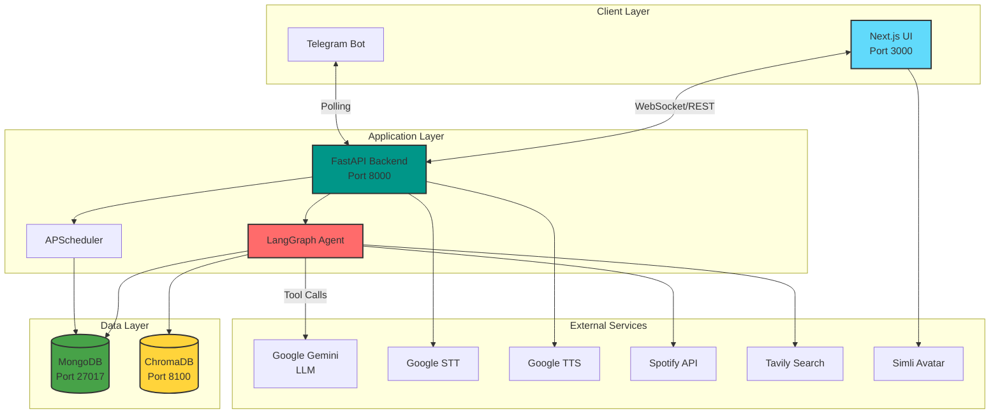

# Hope (أمل) - Bilingual AI Assistant

A production-ready, cloud-based AI assistant with speech recognition, text-to-speech, visual avatar, and intelligent memory. Hope (Amal in Arabic) provides natural bilingual conversations in English and Arabic through a modern web interface and Telegram integration.

[](https://opensource.org/licenses/MIT)
[](https://docs.docker.com/compose/)
[](https://www.python.org/)
[](https://nextjs.org/)

---

## 🌟 Features

### Core Capabilities
- **🗣️ Voice-to-Voice Interaction**: Real-time speech-to-text and text-to-speech with Google Cloud APIs
- **🌍 Bilingual Support**: Seamless English/Arabic conversation with automatic language detection
- **🎭 Visual Avatar**: Interactive 3D avatar powered by Simli for engaging user experience
- **🧠 Intelligent Memory**: Long-term memory with preference learning and context retention
- **🔍 Web Search**: Real-time information retrieval via Tavily AI integration
- **📱 Telegram Bot**: Two-way chat with voice message support and proactive messaging
- **⏰ Smart Scheduling**: Schedule Telegram reminders using natural language time expressions

### Technical Highlights
- **LangChain & LangGraph**: Advanced agent orchestration with tool calling
- **Google Gemini 2.5 Flash**: State-of-the-art language model for natural conversations
- **Async Architecture**: FastAPI backend with async/await for high performance
- **Persistent Storage**: MongoDB for scheduling, ChromaDB for vector embeddings
- **Production Ready**: Health checks, graceful shutdowns, error handling, logging

---

## 🏗️ Architecture



### Services

| Service | Technology | Purpose | Port |
|---------|-----------|---------|------|
| **Frontend** | Next.js 14 + TypeScript | Web UI with voice interface & avatar | 3000 |
| **Backend** | FastAPI + Python 3.12 | API server, agent orchestration | 8000 |
| **Telegram Bot** | Python + Tekore | Two-way chat, voice messages | - |
| **MongoDB** | MongoDB 7 | Persistent storage for scheduling | 27017 |
| **ChromaDB** | ChromaDB 0.6.3 | Vector database for memory embeddings | 8100 |

---

## 🚀 Quick Start

### Prerequisites

- **Docker** & **Docker Compose** (v2.0+)
- **API Keys** (see Configuration section)
- **Spotify Premium** (optional, for music playback)
- **Telegram Account** (optional, for bot features)

### Installation

1. **Clone the repository**
   ```bash
   git clone <repository-url>
   cd AIAssistant
   ```

2. **Configure environment variables**
   ```bash
   cp .env.example .env
   ```
   Edit `.env` with your API keys (see [Configuration](#-configuration) below)

3. **Start all services**
   ```bash
   docker-compose up -d
   ```

4. **Verify services are running**
   ```bash
   docker-compose ps
   ```
   All services should show status `Up (healthy)` or `Up`

5. **Access the application**
   - **Web UI**: http://localhost:3000
   - **API Docs**: http://localhost:8000/docs
   - **Health Check**: http://localhost:8000/health

### First Run Setup

#### Telegram Bot (Optional)
The bot starts automatically if credentials are configured. Send `/start` to your bot on Telegram.

---

## ⚙️ Configuration

### Environment Variables

Copy the example configuration file and customize it with your API keys:

```bash
cp .env.example .env
```

The `.env.example` file contains all required and optional configuration variables with detailed comments. Key variables include:

#### Required
- `GOOGLE_API_KEY` - Google Cloud API key for Gemini, STT, and TTS

#### Optional Features
- `TAVILY_API_KEY` - Enable web search capabilities
- `TELEGRAM_BOT_TOKEN` + `TELEGRAM_USER_ID` - Enable Telegram bot
- `SPOTIFY_CLIENT_ID` + `SPOTIFY_CLIENT_SECRET` - Enable Spotify music playback
- `SIMLI_API_KEY` + `SIMLI_FACE_ID` - Enable visual avatar

#### Auto-configured
MongoDB, ChromaDB, and voice settings are pre-configured for Docker Compose. See `.env.example` for all available options.

### Obtaining API Keys

#### 1. Google Cloud API Key (REQUIRED)
- Visit: https://makersuite.google.com/app/apikey
- Create a new API key
- Enable: **Gemini API**, **Cloud Speech-to-Text API**, **Cloud Text-to-Speech API**

#### 2. Tavily API Key (Optional - Web Search)
- Visit: https://tavily.com
- Sign up for a free account
- Copy your API key from the dashboard

#### 3. Telegram Bot Token (Optional)
- Open Telegram and search for `@BotFather`
- Send `/newbot` and follow the instructions
- Copy the bot token provided
- Get your user ID by messaging `@userinfobot` with `/start`

#### 4. Simli API Key (Optional - Avatar)
- Visit: https://simli.com
- Sign up and create a project
- Copy your API key and face ID

---

## 🎮 Usage

### Web Interface

1. **Open the UI**: http://localhost:3000
2. **Enable microphone** when prompted
3. **Click the avatar** to start a voice conversation
4. **Type messages** in the chat input for text-based interaction

### Telegram Bot

Send messages directly to your bot on Telegram:
- **Text messages**: Type naturally in English or Arabic
- **Voice messages**: Record and send voice notes (Hope replies with voice)
- **Scheduling**: "Remind me in 1 hour to check the code"

### API Endpoints

Explore interactive API documentation:
- **Swagger UI**: http://localhost:8000/docs
- **ReDoc**: http://localhost:8000/redoc

**Key Endpoints:**
- `POST /chat/text` - Text chat with Hope
- `POST /chat/voice` - Voice input processing
- `WS /ws/chat` - WebSocket for real-time streaming

---

## 🛠️ Development

### Project Structure

```
AIAssistant/
├── backend/                 # FastAPI Backend
│   ├── app/
│   │   ├── agent/          # LangChain agent & tools
│   │   │   ├── graph.py    # Agent orchestration
│   │   │   ├── tools.py    # Custom tools (Spotify, Telegram, etc.)
│   │   │   └── prompts.py  # System prompts
│   │   ├── api/            # FastAPI routes
│   │   │   ├── chat.py     # Chat endpoints
│   │   │   ├── spotify.py  # Spotify integration
│   │   │   └── router.py   # API router
│   │   ├── memory/         # Memory & preference learning
│   │   ├── scheduler/      # APScheduler for reminders
│   │   ├── spotify/        # Spotify service (Tekore)
│   │   ├── telegram/       # Telegram bot
│   │   ├── voice/          # STT/TTS services
│   │   ├── config.py       # Configuration management
│   │   └── main.py         # FastAPI application
│   ├── requirements.txt    # Python dependencies
│   └── Dockerfile
├── frontend/               # Next.js Frontend
│   ├── app/               # Next.js App Router
│   │   ├── page.tsx       # Home page with chat UI
│   │   └── layout.tsx     # Root layout
│   ├── components/        # React components
│   ├── hooks/            # Custom React hooks
│   ├── package.json
│   └── Dockerfile
├── docker-compose.yml     # Multi-container orchestration
├── .env                   # Environment variables (create from .env.example)
└── README.md             # This file
```

### Running in Development Mode

**Hot reload is enabled by default** for both backend and frontend:

```bash
# View logs
docker-compose logs -f backend
docker-compose logs -f frontend

# Restart a specific service
docker-compose restart backend

# Rebuild after dependency changes
docker-compose up -d --build backend
```

---

## 🤝 Contributing

Contributions are welcome! Please follow these guidelines:

1. Fork the repository
2. Create a feature branch (`git checkout -b feature/amazing-feature`)
3. Commit your changes (`git commit -m 'Add amazing feature'`)
4. Push to the branch (`git push origin feature/amazing-feature`)
5. Open a Pull Request

### Code Style

- **Python**: Follow PEP 8, use `black` for formatting
- **TypeScript**: Follow Airbnb style guide, use `prettier`
- **Commits**: Use conventional commits (e.g., `feat:`, `fix:`, `docs:`)

---

## 📝 License

This project is licensed under the MIT License - see the [LICENSE](LICENSE) file for details.

---

## 🙏 Acknowledgments

- **Google Cloud**: Gemini, Speech-to-Text, Text-to-Speech APIs
- **LangChain**: Agent orchestration framework
- **Simli**: 3D avatar technology
- **Tavily**: Web search API
- **Telegram**: Bot API

---